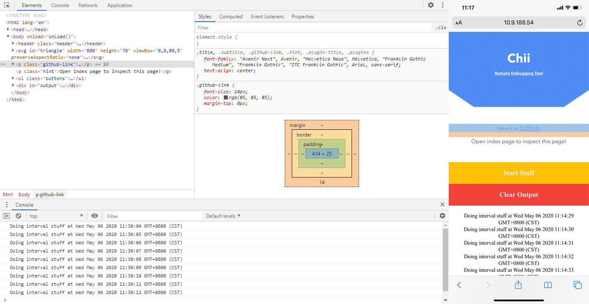

# Chii

[![NPM version][npm-image]][npm-url]
[![Build status][travis-image]][travis-url]
[![License][license-image]][npm-url]

[npm-image]: https://img.shields.io/npm/v/chii.svg
[npm-url]: https://npmjs.org/package/chii
[travis-image]: https://img.shields.io/travis/liriliri/chii.svg
[travis-url]: https://travis-ci.org/liriliri/chii
[license-image]: https://img.shields.io/npm/l/chii.svg

与 [weinre](https://people.apache.org/~pmuellr/weinre/docs/latest/Home.html) 一样的远程调试工具，主要是将 web inspector 替换为最新的 [chrome devtools frontend](https://github.com/ChromeDevTools/devtools-frontend).




## Demo


请扫描二维码或在手机上直接访问：[https://chii.liriliri.io/tests/demo.html](https://chii.liriliri.io/tests/demo.html)

打开 [https://chii.liriliri.io/](https://chii.liriliri.io/) 并点击 inspect 按钮开始调试示例页面。

如果想在其它页面尝试，请在浏览器地址栏上输入以下代码。

```javascript
javascript:(function () { var script = document.createElement('script'); script.src="//chii.liriliri.io/target.js"; document.body.appendChild(script); })();
```

## 安装

可以通过 npm 安装。

```bash
npm install chii -g
```

## 使用 

用下面的命令开启服务。

```bash
chii start -p 8080
```

在你的页面中使用这个脚本注入代码。


```html
<script src="//host-machine-ip:8080/target.js"></script>
```

然后就可以访问 localhost:8080 开始调试页面。

## 相关项目

* [whistle.chii](https://github.com/liriliri/whistle.chii)：Whistle Chii 插件。